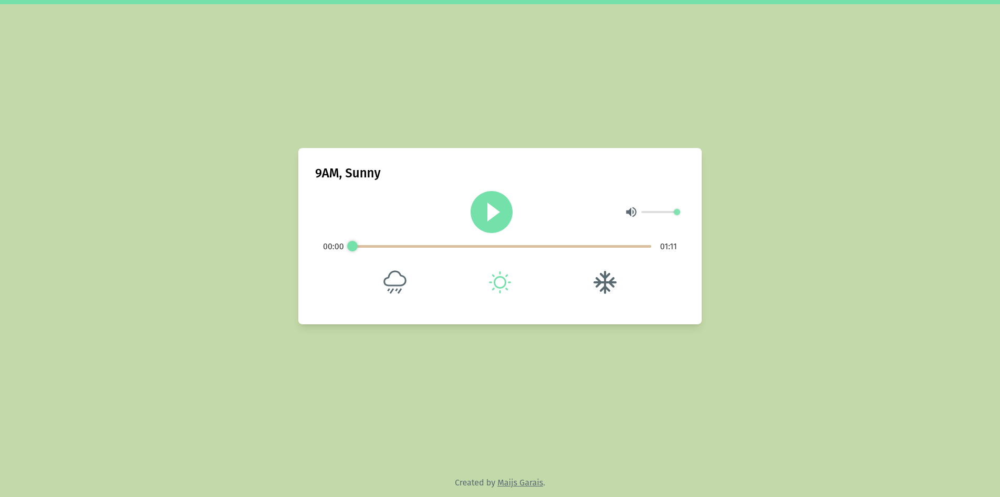

# ACNH Background Music Player

A music player app, querying the [ACNH API](https://acnhapi.com/) for the background music corresponding to the user's local time. Updates next song at the top of the hour, and has weather selection.

## Table of contents

- [Overview](#overview)
  - [Screenshot](#screenshot)
  - [Links](#links)
- [My process](#my-process)
  - [Built with](#built-with)
  - [What I learned](#what-i-learned)
  - [Continued development](#continued-development)
- [Author](#author)

## Overview

### Screenshot

### Links

- Live Site URL: [ACNH Background Music Player](https://acnh-player.vercel.app/)

## My process

### Built with

- React
- [React H5 Audio Player](https://www.npmjs.com/package/react-h5-audio-player)
- Tailwind
- Flexbox
- Mobile-first workflow
- [ACNH API](https://acnhapi.com/) - for querying the audio files

### What I learned

I had no idea that the native `audio` component couldn't really be styled! I had a bit of knowledge about working with playing audio from when I initiated the development for an audio fairytale app while working under CUBE, but that was using Flutter for mobile - while the logic was similar, it took a while to understand how to style it the way I want it to.

### Continued development

One idea I had was asking the user for permission to access their location, then determining the local weather with another API, and setting the weather option automatically with it (or keeping it on manual selection if the user doesn't grant permission or just prefers to do so).

## Author

- Website - [Maijs Garais](https://maijsgarais.com)
- Mastodon - [@maijs@social.linux.pizza](https://social.linux.pizza/@maijs)
